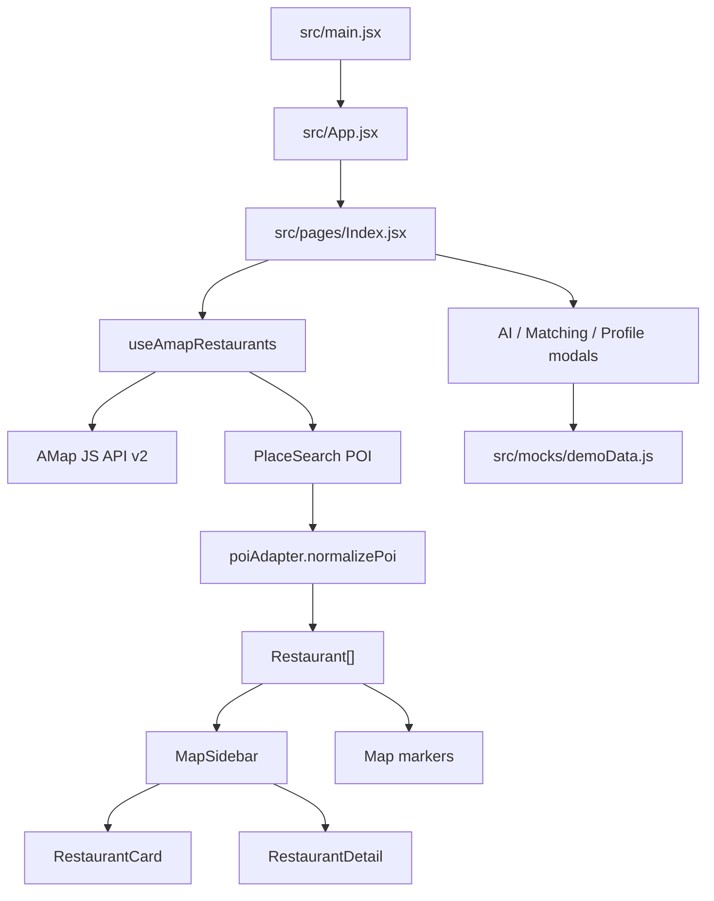

# 前端架构说明

文档状态：当前实现说明  
最后更新：2026-04-22

## 1. 架构目标

当前架构服务于一个优先级：真实商家主链路稳定。地图、商家列表、餐厅详情、搜索筛选必须围绕同一个 `Restaurant` 模型协同，不再让组件各自读取不同来源的数据。

## 2. 页面数据流



## 3. 分层职责

### 页面层

`src/pages/Index.jsx` 只做页面编排：

- 调用 `useAmapRestaurants`。
- 保存搜索、排序、分类、弹窗开关等 UI 状态。
- 把餐厅数组、选中餐厅和回调传给子组件。

页面层不应该直接写高德地图细节。

### 地图数据层

`src/hooks/useAmapRestaurants.js` 负责：

- 加载高德 JS API。
- 初始化和销毁地图实例。
- 调用 `PlaceSearch` 搜索餐饮 POI。
- 创建、更新、清理 marker。
- 维护 `restaurants`、`selectedRestaurant`、`loading`、`error`。
- 在刷新 POI 时保留前端临时的收藏、点赞状态。

### AMap 配置层

`src/lib/amap/config.js` 负责：

- 高德 Key 和安全密钥读取。
- 默认中心点、搜索半径、地图样式、地图 features。
- 分类和关键词映射。
- PlaceSearch 默认参数。

新 Agent 不要在组件里散写地图常量。

### POI 适配层

`src/lib/amap/poiAdapter.js` 是高德 POI 到前端餐厅模型的唯一入口。组件不直接消费原始 POI 字段。

### 展示工具层

`src/lib/restaurants/display.js` 放纯展示函数：

- 排序
- 距离格式化
- 价格格式化
- 价格等级
- 繁忙状态展示

## 4. 统一 Restaurant 模型

组件应只依赖以下结构：

```js
{
  id,
  source,
  poiId,
  name,
  coordinates,
  rating,
  reviewCount,
  avgPrice,
  priceLevel,
  distance,
  location,
  tags,
  category,
  photos,
  tel,
  isFavorite,
  isLiked,
  likes,
  recentReviews,
  hotDishes
}
```

字段原则：

- `source` 当前主链路应为 `amap`。
- `recentReviews` 和 `hotDishes` 没有真实数据时保持空数组。
- `photos` 只使用高德 POI 返回的真实图片或空态。
- 不能为了界面好看而生成虚构评价、虚构菜品、虚构定位。

## 5. 状态所有权

- `selectedRestaurant`：页面或 `useAmapRestaurants` 统一维护。
- 收藏、点赞：当前为前端临时状态，由父层回写后传给卡片和详情。
- 详情开关：由 `selectedRestaurant` 是否存在决定。
- AI、饭搭子、个人中心：弹窗开关在页面层维护，数据来自演示数据模块。

## 6. Mock 边界

允许 mock 的区域：

- AI 助手演示回复。
- 饭搭子匹配演示用户。
- 个人中心演示足迹、标签、勋章。

要求：

- 数据集中在 `src/mocks/demoData.js`。
- UI 明确显示“演示功能”或“待接入真实数据”。
- 不得把演示评价、演示菜品、演示商家混入 `Restaurant` 主模型。

## 7. 后续后端接入位置

未来后端建议按能力分层：

- 商家基础库：以高德 POI 为初始来源，允许平台纠错和补充。
- 用户系统：认证、收藏、点赞、足迹。
- 评价系统：真实评价、图片、审核、可信等级。
- 匹配系统：饭搭子请求、匹配结果、安全风控。

接入后端时，优先新增 API 层或 Query Hook，不要让 UI 组件直接拼接口。

## 8. 已知架构缺口

- 没有真实后端 API 层。
- 没有持久化收藏、点赞、评价。
- 没有学生认证流程。
- 没有图片上传、审核和可信等级计算。
- 没有可用 ESLint 配置。
- 浏览器端地图加载仍需要在真实本地环境持续验证。
