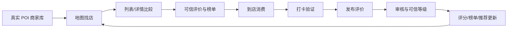

# 岳麓食纪 产品需求文档（PRD）

文档状态：MVP 产品需求文档  
产品阶段：MVP 方案设计 / 原型验证期  
PRD 版本：v1.0  
目标产品版本：v0.2 真实评价 MVP  
最后更新：2026-04-24  
产品负责人：待定  
研发负责人：待定  

## 0. 文档说明

本文档定义岳麓食纪 MVP 阶段的产品目标、用户场景、功能范围、数据模型、端到端业务闭环、可信评价机制、指标体系、风险控制与版本规划。

本阶段重点是建立“真实商家 + 学生认证 + 到店打卡 + 可信评价 + 可解释推荐”的核心链路。地图、餐厅列表、餐厅详情、评价、榜单、社区、个人中心、饭搭子与 AI 助手均围绕这一链路分层设计。

## 1. 产品概述

### 1.1 产品名称

岳麓食纪

### 1.2 一句话定位

面向岳麓大学城学生的真实美食地图，用学生认证、真实打卡和本地评价，帮同学快速找到可信、好吃、适合当下场景的餐厅。

### 1.3 产品愿景

成为大学城学生找饭、探店、避雷、约饭的本地生活入口。相比通用点评平台，岳麓食纪更关注“附近学生真实吃过什么、怎么评价、此刻适不适合去”。

### 1.4 核心主张

真实优先：

- 评价来自本地大学生或经可信机制标记的用户。
- 评价尽量绑定真实到店、真实图片、真实消费和真实时间。
- 评分不只看好评，也要呈现避雷、排队、价格、分量、出餐速度等学生高频决策信息。
- 推荐逻辑需要解释“为什么推荐”，避免只给模糊高分。

### 1.5 产品闭环摘要

岳麓食纪的核心闭环为：

```text
真实商家发现 -> 餐厅比较 -> 可信评价决策 -> 到店打卡 -> 发布评价 -> 审核与可信分层 -> 评分/榜单/推荐更新
```

该闭环决定本产品的功能优先级：先保证商家对象真实、地图与列表一致，再建立学生认证和评价可信机制，最后扩展个性化推荐、社区分发和饭搭子社交。

## 2. 背景与机会

### 2.1 背景

岳麓大学城聚集湖南大学、中南大学、湖南师范大学等高校，餐饮密度高、流动性强，学生日常有高频“吃什么”“去哪吃”“有没有坑”“要不要排队”“能不能找人一起吃”的需求。

产品方案覆盖以下方向：

- 基于高德地图展示岳麓大学城餐厅点位。
- 展示餐厅卡片、详情、热门菜品、学生评价。
- 支持搜索、分类筛选、价格/距离/评分排序。
- 支持收藏、点赞、打卡评价、评价筛选。
- 支持 AI 语音助手、随机智选、饭搭子匹配。
- 支持底部全局入口，承载榜单、语音助手和社区动态。
- 个人中心中已有学生认证、打卡足迹、偏好、勋章等设想。

### 2.2 机会点

通用点评平台的信息足够多，但对学生场景不够“近”和“真”：

- 大量评价无法判断是否来自本地学生。
- 商业推广、刷评、游客评价会影响学生判断。
- 学生更关心“下课后走几分钟、人均多少钱、分量够不够、是否适合一个人/多人、现在排不排队”。
- 大学校区周边很多小店依赖口口相传，信息更新不及时。

岳麓食纪的差异化机会，是把“学生身份 + 到店打卡 + 本地地图 + 场景化推荐”组合成更可信的决策体验。

## 3. 目标与非目标

### 3.1 业务目标

- 建立岳麓大学城餐厅基础库，覆盖学生高频就餐区域。
- 沉淀一批可信学生评价，形成“真实”心智。
- 提升用户从打开地图到决定去哪吃的效率。
- 验证学生认证、打卡评价和饭搭子匹配的使用意愿。

### 3.2 用户目标

- 快速找到附近靠谱餐厅。
- 知道一家店为什么值得去或为什么要避雷。
- 按预算、距离、口味、排队情况、用餐目的筛选。
- 记录自己的吃饭足迹和收藏。
- 在想结伴时找到合适饭搭子。

### 3.3 非目标

当前阶段暂不追求：

- 完整商家后台和商家营销系统。
- 外卖下单、支付、团购券交易。
- 全长沙范围覆盖。
- 复杂社交关系链。
- 完整商业化广告系统。

## 4. 用户与场景

### 4.1 核心用户

本地在校大学生：

- 学校：湖南大学、中南大学、湖南师范大学等岳麓大学城高校。
- 使用频率：日常高频，午饭、晚饭、夜宵、奶茶、周末探店。
- 核心诉求：便宜、近、好吃、可信、少踩坑。

### 4.2 次级用户

新生 / 外地同学：

- 不熟悉校区周边餐饮分布。
- 更依赖地图、标签、学长学姐推荐和避雷评价。

组队用餐用户：

- 想拼饭、探店、找同校或附近学校同学一起吃。
- 关注口味、人数、社交目的和安全感。

### 4.3 典型场景

- 下课后 15 分钟内决定去哪吃午饭。
- 晚上临时想吃夜宵，需要找近、还开、评价稳的店。
- 想喝奶茶，比较不同店排队情况和学生评价。
- 新生第一次来岳麓大学城，想知道“堕落街哪些店真的值得吃”。
- 宿舍几个人想聚餐，希望找到人均合适、口碑稳定的店。
- 想去一家热门店，但希望找同样想去的人一起排队或拼桌。

## 5. 产品原则

### 5.1 真实优先

任何评分、推荐、榜单都应优先使用可信来源，并显式标记来源可信度。

### 5.2 学生视角

信息展示要围绕学生决策，而不是商家营销。重点字段包括距离、人均、分量、排队、出餐速度、适合场景、是否避雷。

### 5.3 地图即入口

用户打开后应立即看到附近餐厅分布，列表与地图联动，减少查找成本。

### 5.4 轻量参与

评价、收藏、打卡、匹配都应尽量少步骤完成。真实机制不能让用户觉得负担过重。

### 5.5 可信但不压迫

学生认证、到店验证、图片证明等机制要增强信任，但要保护隐私，不公开敏感身份信息。

## 6. MVP 范围

### 6.1 MVP 必做

1. 地图找店
   - 展示岳麓大学城餐厅点位。
   - 地图移动后刷新附近餐厅列表。
   - 支持定位回到大学城中心。

2. 餐厅列表与详情
   - 展示名称、评分、人均、距离、位置、标签、热门菜品、收藏状态。
   - 展示学生评价摘要。
   - 进入详情后展示更完整的菜品、评价和打卡入口。

3. 搜索与筛选
   - 支持按餐厅名、标签搜索。
   - 支持按距离、价格、评分排序。
   - 支持按午饭/晚饭、快餐、奶茶、长沙特色等分类筛选。
   - 支持查看收藏餐厅。

4. 真实评价
   - 用户可对餐厅打卡评价。
   - 评价至少包含评分、文字、可选图片。
   - 评分维度包括口味、环境、服务。
   - 评价列表支持全部、好评、有图、避雷筛选。

5. 学生认证
   - 用户身份展示学生认证标记。
   - MVP 阶段支持最小可用认证流程，认证结果影响评价权重和社交权限。

6. 智选推荐
   - 支持随机选择餐厅。
   - 支持基于用户输入或偏好的简单推荐。
   - 推荐结果需要展示关键原因，如距离近、评分高、人均低、同校学生评价多。

7. 个人中心
   - 展示用户学校、认证状态、打卡足迹、收藏、用餐偏好。
   - 支持口味偏好和价格偏好设置。

8. 榜单与社区入口
   - 底部全局按钮 BAR 提供榜单、语音、社区三个高频入口。
   - 榜单支持多类榜单，帮助用户快速发现当前值得看的店。
   - 社区以信息流方式展示最新评价，并遵守评价审核与可信等级规则。
   - 点击榜单餐厅应联动地图和餐厅详情。

### 6.2 MVP 可选

- 饭搭子匹配基础流程。
- 用户勋章和社区标签。
- AI 语音输入。
- 实时排队/繁忙状态。

### 6.3 后续版本

- 商家纠错与信息更新。
- 到店 GPS 校验、消费凭证校验、校园邮箱认证。
- 真实图片审核、异常评价检测。
- 学校/校区维度榜单。
- 饭搭子群聊和安全机制。
- 运营后台、内容审核后台、数据看板。

## 7. 核心功能需求

### 7.1 地图首页

#### 用户故事

作为学生，我希望一打开应用就看到附近有哪些能吃的店，并能快速判断哪家适合现在去。

#### 功能要求

- 默认地图中心为岳麓大学城。
- 地图上用餐厅标记展示店铺名称。
- 点击标记后，地图居中并打开对应餐厅详情或选中列表项。
- 地图加载失败时提供重试和明确提示。
- 支持移动地图后按当前位置刷新附近餐厅。

#### 验收标准

- 用户打开首页后 3 秒内应看到地图加载状态或错误状态。
- 点击餐厅标记后，餐厅信息与地图中心同步。
- 地图失败时不应白屏。

### 7.2 餐厅列表

#### 用户故事

作为学生，我希望在地图旁边快速浏览附近餐厅，比较价格、距离、评分和评价。

#### 功能要求

- 列表展示附近餐厅数量。
- 卡片展示餐厅图、名称、人均、吃过次数、繁忙状态、评分、距离、标签、学生评价摘要。
- 支持收藏、点赞、进入详情、打卡评价、发起搭一搭。
- 收藏状态应可即时反馈。

#### 验收标准

- 搜索、排序、分类切换后列表立即更新。
- 无结果时展示空状态。
- 收藏入口不应误触进入详情。

### 7.3 餐厅详情

#### 用户故事

作为学生，我希望进入详情后能看到这家店的真实口碑、热门菜和是否适合现在去。

#### 功能要求

- 展示餐厅图片、名称、评分、人均、距离、位置、标签。
- 展示热门菜品和价格。
- 展示近期学生评价。
- 展示繁忙状态，如无需排队、有少量空位、当前排队较多。
- 提供搭一搭和打卡评价入口。

#### 验收标准

- 从列表进入详情后可返回列表。
- 详情信息与列表所选餐厅一致。
- 底部主操作始终可见。

### 7.4 真实评价体系

#### 用户故事

作为学生，我希望看到的评价尽量来自真正去过的同学，而不是刷出来的广告评价。

#### 功能要求

- 评价发布字段：
  - 餐厅 ID
  - 用户 ID
  - 总评分
  - 口味评分
  - 环境评分
  - 服务评分
  - 文字评价
  - 图片
  - 发布时间
  - 到店验证状态
  - 学生认证状态
- 评价展示需标记可信信息：
  - 学生认证
  - 已到店
  - 有图
  - 近期评价
  - 同校用户
- 评价支持筛选：
  - 全部
  - 好评
  - 有图
  - 避雷
- 对疑似刷评、辱骂、商家广告、无关内容，应进入审核或折叠。

#### 验收标准

- 未填写评分或文字时不可发布。
- 评价发布后应出现在对应餐厅评价列表。
- 评价可信标记应与后台数据一致。

### 7.5 学生认证

#### 用户故事

作为学生，我希望知道哪些评价来自本地同学，从而更相信他们的推荐。

#### MVP 方案

MVP 阶段支持最小可用学生认证流程，认证方式可按接入成本逐步开放：

- 校园邮箱认证。
- 学生证照片人工审核。
- 校园网 / 地理位置辅助验证。
- 学信或校园身份信息的间接验证。

#### 展示原则

- 公开展示学校和认证标识。
- 不公开学号、真实姓名、证件照等敏感信息。
- 支持用户选择昵称展示。

#### 验收标准

- 未认证用户可浏览内容，但评价权重低于认证学生。
- 认证学生评价在列表和详情中有明显标记。
- 认证失败时给出明确原因和重试入口。

### 7.6 智选推荐

#### 用户故事

作为选择困难的学生，我希望告诉产品我的条件后，它直接推荐几个靠谱选择。

#### 功能要求

- 支持“今天吃什么”的随机智选。
- 支持基于距离、评分、人均、分类、偏好、收藏的推荐。
- 支持语音或文本输入，如“天马附近评分最高的湘菜”。
- 推荐结果需展示推荐理由。

#### 推荐规则初版

推荐得分可由以下因素组成：

- 距离：越近得分越高。
- 真实评价：认证学生评价越多得分越高。
- 评分：近期评分高得分高。
- 价格：符合用户预算得分高。
- 场景：匹配午饭、晚饭、夜宵、奶茶、聚餐等需求。
- 负反馈：近期避雷评价多则降权。

#### 验收标准

- 推荐结果不能只展示店名，必须展示至少 2 条理由。
- 当条件过窄无结果时，应提供放宽条件的提示。

### 7.7 饭搭子匹配

#### 用户故事

作为想结伴吃饭的学生，我希望找到也想吃同一家店或口味相近的同学。

#### 功能要求

- 支持从餐厅详情发起“找这家店饭搭子”。
- 支持从全局入口发起“找周边饭搭子”。
- 用户可选择人数、口味偏好、目的，如聊天交友、组队探店、大餐拼饭。
- 匹配结果展示昵称、学校、共同目标、匹配度、标签。
- 支持打招呼或加入临时群聊。

#### 安全要求

- 默认不展示精确宿舍、手机号、微信号等敏感信息。
- 聊天和群聊应支持举报、拉黑。
- 未认证用户发起匹配可受限制。

#### 验收标准

- 从指定餐厅发起匹配时，匹配页应展示目标餐厅。
- 匹配结果应至少说明共同目标和匹配原因。

### 7.8 个人中心

#### 用户故事

作为学生，我希望记录自己的吃饭足迹、收藏和偏好，让推荐越来越懂我。

#### 功能要求

- 展示头像、昵称、学校、学生认证状态。
- 展示打卡足迹。
- 展示收藏餐厅。
- 支持设置口味偏好和价格区间。
- 展示社区标签和勋章。

#### 验收标准

- 用户修改偏好后，推荐应能读取新偏好。
- 打卡成功后足迹数量增加。

### 7.9 榜单

#### 用户故事

作为学生，我希望不只靠搜索，也能通过榜单快速知道附近哪些店更值得关注。

#### 功能要求

- 首页底部全局按钮 BAR 提供“榜单”入口。
- 榜单以中央上方悬浮页面展示，不跳出地图首页。
- 支持多类榜单：
  - 综合推荐
  - 距离最近
  - 高分优先
  - 人均友好
  - 学生热评榜
- 榜单需标记数据来源：
  - 基于高德真实 POI 推导。
  - 基于平台真实学生评价聚合。
- 点击榜单餐厅后，应聚焦地图对应商家并打开或选中该餐厅。

#### 验收标准

- 点击底部“榜单”后，中央上方浮层平滑打开。
- 切换不同榜单时，列表内容稳定且不影响地图加载状态。
- 点击榜单餐厅后，浮层关闭，地图和左侧详情同步到该餐厅。
- 数据不足时展示空态或降级榜单，不使用虚构评价补齐。

### 7.10 社区动态

#### 用户故事

作为学生，我希望像刷博客一样看到附近同学最新吃了什么、怎么评价，从而发现新店和避雷信息。

#### 功能要求

- 首页底部全局按钮 BAR 提供“社区”入口。
- 社区以中央上方悬浮页面展示，不跳出地图首页。
- 社区内容采用评价信息流形态，卡片展示：
  - 作者昵称
  - 学校
  - 认证状态
  - 餐厅名称
  - 评分
  - 发布时间
  - 评价正文
  - 标签
- 社区动态读取真实 Review 数据，并遵守评价审核与可信等级规则。

#### 验收标准

- 点击底部“社区”后，中央上方浮层平滑打开。
- 社区评价按时间倒序展示。
- 未审核通过或低可信内容不进入餐厅评分、榜单权重或详情推荐评价列表。
- 关闭或切换底部 BAR 入口时，浮层状态一致。

## 8. 数据模型

### 8.1 用户 User

- id
- nickname
- avatarUrl
- school
- campus
- verificationStatus
- tastePreference
- pricePreference
- createdAt
- updatedAt

### 8.2 餐厅 Restaurant

- id
- name
- coordinates
- address
- locationDescription
- category
- tags
- avgRating
- avgPrice
- priceLevel
- hotDishes
- businessHours
- busyStatus
- sourceStatus
- createdAt
- updatedAt

### 8.3 评价 Review

- id
- restaurantId
- userId
- rating
- tasteRating
- environmentRating
- serviceRating
- comment
- imageUrls
- checkinId
- verificationLevel
- status
- likeCount
- createdAt
- updatedAt

### 8.4 打卡 Checkin

- id
- userId
- restaurantId
- checkinTime
- location
- locationVerified
- imageUrls
- receiptVerified
- status

### 8.5 收藏 Favorite

- id
- userId
- restaurantId
- createdAt

### 8.6 匹配 MatchRequest

- id
- userId
- targetRestaurantId
- peopleCount
- tasteTags
- purpose
- status
- createdAt
- expiresAt

## 9. 真实性机制

### 9.1 评价可信等级

评价分为 4 个等级：

- L0：未认证普通评价。
- L1：学生认证评价。
- L2：学生认证 + 到店位置验证。
- L3：学生认证 + 到店位置验证 + 图片或消费凭证。

### 9.2 权重规则

- L2、L3 评价在评分计算中权重更高。
- 近期评价权重高于历史评价。
- 同一用户短时间内频繁评价多店，应触发异常检测。
- 同一设备或相似文本批量评价，应降权或审核。
- 商家自评、广告式评价、重复模板评价应折叠。

### 9.3 展示规则

- 餐厅评分旁展示“认证学生评价占比”。
- 评价列表优先展示高可信、近期、有信息量评价。
- 避雷评价不应被隐藏，但需防止恶意攻击。
- AI 生成评价必须标记或限制用于草稿辅助，不应直接伪装成真实评价。

## 10. 内容与审核

### 10.1 用户生成内容范围

- 餐厅评价。
- 餐厅图片。
- 点赞、收藏、打卡足迹。
- 饭搭子标签、打招呼内容。

### 10.2 审核要求

需要识别和处理：

- 虚假评价。
- 商家广告。
- 人身攻击、辱骂、歧视。
- 泄露隐私。
- 涉黄、涉赌、涉毒等违法内容。
- 恶意刷屏和重复内容。

### 10.3 处理方式

- 正常展示。
- 降权展示。
- 折叠展示。
- 进入人工审核。
- 删除并通知用户。
- 限制用户发布能力。

## 11. 指标体系

### 11.1 北极星指标

每周由认证学生贡献的有效真实评价数。

### 11.2 核心指标

- 新增认证学生数。
- 餐厅详情页访问率。
- 从打开应用到点击餐厅详情的转化率。
- 从详情到打卡评价的转化率。
- 每家餐厅有效评价数。
- 有图评价占比。
- L2/L3 高可信评价占比。
- 收藏率。
- 智选使用率。
- 榜单打开率。
- 榜单餐厅点击率。
- 社区动态浏览量。
- 社区评价点击率。
- 饭搭子匹配发起数和成功数。

### 11.3 体验指标

- 首页可交互时间。
- 地图加载失败率。
- 搜索无结果率。
- 推荐点击率。
- 用户举报率。
- 审核通过率。

## 12. 非功能需求

### 12.1 性能

- 首页首屏应尽量在 3 秒内可交互。
- 地图加载失败需有降级状态。
- 餐厅列表滚动应保持流畅。
- 图片需要懒加载和压缩。

### 12.2 可用性

- 移动端优先，同时兼容桌面端原型展示。
- 关键操作按钮需明显：搜索、筛选、收藏、打卡、详情、返回。
- 空状态、错误状态、加载状态完整。

### 12.3 隐私

- 不公开学号、证件、手机号、精确宿舍位置。
- 到店位置仅用于验证，不默认公开。
- 用户可删除或隐藏个人足迹。

### 12.4 安全

- 认证材料需要加密存储或使用第三方认证结果，不长期保存原始敏感图片。
- 饭搭子相关功能需要举报、拉黑、风控。
- 后台接口需要鉴权和频率限制。

## 13. 版本规划

### 13.1 v0.1 前端基座与真实 POI

目标：完成地图找店主链路和统一餐厅模型，为真实评价闭环提供稳定商家对象。

- 接入高德 POI，建立真实商家发现能力。
- 统一 `Restaurant` 模型，保证地图、列表、详情使用同一餐厅对象。
- 完成搜索、筛选、排序、收藏、详情联动等基础体验。
- 将未接真实数据的模块与主链路隔离。

### 13.2 v0.2 真实评价 MVP

目标：验证“真实评价”核心价值。

- 接入用户系统。
- 接入真实评价发布与读取。
- 打通学生认证最小可用流程。
- 加入评价可信等级展示。

### 13.3 v0.3 推荐与个性化

目标：让用户更快决定吃什么。

- 接入用户偏好。
- 推荐结果展示推荐理由。
- 支持更多场景筛选，如夜宵、赶课、聚餐、一个人吃。

### 13.4 v0.4 社交匹配

目标：验证饭搭子需求。

- 完成匹配请求和匹配结果数据闭环。
- 增加打招呼、临时群聊、举报拉黑。
- 限制未认证用户的社交能力。

## 14. 风险与应对

### 14.1 真实评价冷启动难

风险：没有足够真实评价时，产品差异化不明显。

应对：

- 先覆盖少量高频区域和高频店。
- 通过校园种子用户贡献首批评价。
- 设置打卡、勋章、榜单等轻激励。

### 14.2 刷评和商家干预

风险：真实性心智一旦被破坏，产品价值会下降。

应对：

- 学生认证和到店验证提高权重。
- 异常评价检测和人工审核。
- 商家内容与学生评价严格区分。

### 14.3 认证门槛影响增长

风险：认证流程过重导致用户不愿参与。

应对：

- 浏览不强制认证。
- 发布普通评价不一定强制认证，但低权重展示。
- 高影响力能力，如高权重评价、饭搭子匹配、榜单影响，需要认证。

### 14.4 社交安全风险

风险：饭搭子功能涉及陌生人社交。

应对：

- 默认只展示学校、昵称和标签。
- 必须提供举报、拉黑、限制联系方式暴露。
- 对未认证用户限制匹配和聊天能力。

## 15. 实施范围与依赖

### 15.1 MVP 交付范围

MVP 版本应完成以下能力闭环：

- 商家发现：基于真实 POI 和平台商家模型展示餐厅点位、列表和详情。
- 搜索筛选：支持关键词、分类、距离、价格、评分、收藏等常用筛选。
- 评价发布：支持评分、文字、图片、到店打卡绑定和审核状态。
- 学生认证：支持最小可用认证流程，并在评价和用户信息中展示认证状态。
- 可信等级：按学生认证、到店验证、图片/凭证、内容质量计算评价可信等级。
- 榜单推荐：支持综合推荐、距离最近、高分优先、人均友好、学生热评等榜单。
- 个人中心：展示认证状态、收藏、足迹、评价、偏好设置。
- 内容审核：支持评价审核、举报、折叠、删除、用户发布限制。

### 15.2 上线依赖

- 地图服务：高德地图 JS API、POI 搜索、地理编码和浏览器定位能力。
- 用户系统：登录、用户资料、学校信息、认证状态、权限控制。
- 数据服务：商家库、评价库、打卡记录、收藏记录、榜单聚合。
- 图片服务：图片上传、压缩、存储、鉴黄/违规检测。
- 审核后台：内容审核、举报处理、用户限制、运营配置。
- 埋点系统：页面访问、搜索筛选、详情点击、评价发布、打卡、榜单点击。

### 15.3 暂不纳入 MVP

- 外卖下单、支付、团购券交易。
- 完整商家后台和广告投放。
- 跨城市扩张。
- 复杂好友关系链和长期群聊。
- 机器学习排序模型。
- 全自动证件 OCR 认证。

## 16. 待确认问题

- 首期聚焦哪些学校和区域：湖南大学、中南大学、湖南师范大学是否全部覆盖？
- 学生认证优先采用哪种方式：校园邮箱、学生证、人工审核，还是先做邀请码？
- 真实评价是否必须绑定到店打卡？
- 是否允许非学生用户发布评价？
- 餐厅基础数据由谁维护：平台运营、用户纠错，还是商家认领？
- 饭搭子功能是否进入 MVP，还是等评价闭环稳定后再做？
- AI 生成评价的产品边界：仅作为草稿润色，不允许一键伪装为真实评价。

## 17. 信息架构

- 首页地图
  - 地图点位
  - 附近餐厅列表
  - 搜索
  - 筛选
  - 排序
  - 智选
  - 定位
  - 底部全局按钮 BAR
    - 榜单
    - 语音助手
    - 社区
- 餐厅详情
  - 基础信息
  - 热门菜品
  - 真实评价
  - 避雷评价
  - 打卡评价
  - 搭一搭
- 评价中心
  - 发布评价
  - 图片上传
  - 评分维度
  - 可信标记
  - 审核状态
- 个人中心
  - 学生认证
  - 我的收藏
  - 我的足迹
  - 我的评价
  - 用餐偏好
  - 勋章标签
- 饭搭子
  - 偏好选择
  - 匹配结果
  - 打招呼
  - 临时群聊
  - 举报拉黑

## 18. 端到端业务闭环设计

### 18.1 主闭环

岳麓食纪的主闭环不是“展示餐厅”，而是“让学生用可信信息完成吃饭决策，并反向贡献可信信息”。



### 18.2 分层闭环

商家发现闭环：

- 来源：高德 POI 作为初始商家底座。
- 处理：统一转换为 `Restaurant` 模型，前端不直接消费高德原始字段。
- 补充：后续通过用户纠错、平台运营和商家认领补齐营业时间、价格、标签、图片。
- 输出：地图点位、列表卡片、餐厅详情、榜单候选池。

评价可信闭环：

- 来源：认证学生、到店打卡、图片或消费凭证。
- 处理：按 L0-L3 可信等级计算权重，异常内容进入审核。
- 输出：餐厅评分、避雷标签、学生热评榜、推荐解释。

推荐决策闭环：

- 来源：距离、价格、分类、评价可信度、用户偏好、负反馈。
- 处理：规则评分优先，后续再引入学习排序。
- 输出：智选结果、榜单排序、场景推荐理由。

社交扩展闭环：

- 来源：用户目标餐厅、时间、人数、口味、学校、认证状态。
- 处理：匹配同目标或相似偏好的用户，限制未认证用户能力。
- 输出：饭搭子匹配、打招呼、临时群聊、举报拉黑。

### 18.3 关键产品取舍

- 先真实 POI，后真实评价：商家位置必须先可信，否则评价和推荐没有稳定对象。
- 先规则推荐，后算法推荐：冷启动阶段数据不足，规则可解释性比复杂模型更重要。
- 先轻认证，后强认证：浏览和低权重评价降低门槛，高权重评价和饭搭子再要求认证。
- 先校园小范围，后城市扩张：大学城场景依赖本地密度，首期应聚焦少量高频区域。
- 非核心入口分阶段接入：AI、饭搭子、社区可以作为扩展能力推进，但不得污染真实商家主链路。

## 19. 服务与接口设计

### 19.1 服务边界

后端按以下领域服务或模块拆分：

- `RestaurantService`：商家基础库、POI 绑定、纠错、标签、营业信息。
- `ReviewService`：评价发布、读取、筛选、评分聚合、审核状态。
- `CheckinService`：到店打卡、地理围栏、图片/凭证验证。
- `IdentityService`：学生认证、学校信息、认证等级、隐私字段。
- `RecommendationService`：智选、榜单、场景推荐、推荐理由。
- `MatchService`：饭搭子请求、候选匹配、打招呼、临时会话。
- `ModerationService`：内容审核、举报、风控、用户限制。

### 19.2 核心接口

餐厅发现：

```http
GET /api/restaurants?lat={lat}&lng={lng}&radius={meters}&keyword={keyword}&category={category}&sort={sort}
```

返回重点：

- `restaurants[]`：统一 `Restaurant` 模型。
- `source`：`amap`、`platform` 或 `merged`。
- `dataCompleteness`：商家信息完整度，用于提示缺失字段。

餐厅详情：

```http
GET /api/restaurants/{restaurantId}
```

返回重点：

- 基础信息。
- 聚合评分。
- 可信评价摘要。
- 热门标签。
- 当前用户收藏、点赞、打卡状态。

发布评价：

```http
POST /api/restaurants/{restaurantId}/reviews
```

请求重点：

- `rating`、`tasteRating`、`environmentRating`、`serviceRating`。
- `comment`、`imageIds`、`checkinId`。
- `clientTraceId`：防止重复提交。

打卡验证：

```http
POST /api/checkins
```

请求重点：

- `restaurantId`。
- `lat`、`lng`。
- `imageIds`、`receiptImageId` 可选。

智选推荐：

```http
POST /api/recommendations/decide
```

请求重点：

- `scene`：午饭、晚饭、夜宵、奶茶、聚餐、赶课。
- `budgetRange`、`distanceLimit`、`tasteTags`。
- `userContext`：收藏、偏好、最近浏览。

返回重点：

- `results[]`。
- `scoreBreakdown`。
- `reasons[]`。
- `fallbackSuggestion`。

饭搭子匹配：

```http
POST /api/matches
GET /api/matches/{matchRequestId}/candidates
POST /api/matches/{matchRequestId}/greetings
```

返回重点：

- 候选人不暴露手机号、微信号、精确住址。
- 匹配原因必须可解释。
- 未认证或被举报用户应降权或受限。

### 19.3 数据一致性原则

- `restaurantId` 是平台内部主键，`poiId` 是外部来源标识，不能混用。
- 评价、收藏、打卡都绑定平台内部 `restaurantId`。
- 高德 POI 更新后，通过 `poiId + 坐标 + 名称相似度` 与平台商家合并。
- 评分聚合采用异步更新，发布评价后先展示用户自己的评价，再刷新聚合分。
- 审核未通过的评价不进入评分、榜单和推荐权重。

## 20. 可信评分与推荐规则

### 20.1 评价可信分

单条评价可信分由以下维度组成：

| 维度 | 说明 | MVP 权重 |
| --- | --- | --- |
| 学生认证 | 是否通过学生身份认证 | 30% |
| 到店验证 | 是否在餐厅附近完成打卡 | 25% |
| 内容质量 | 字数、图片、具体菜品、避雷细节 | 20% |
| 时间新鲜度 | 最近评价更能反映当前体验 | 15% |
| 用户历史 | 历史评价通过率、举报率、重复率 | 10% |

可信分不直接展示给用户，可转化为“认证学生”“已到店”“有图”“近期”等可理解标签。

### 20.2 餐厅综合分

MVP 阶段餐厅综合分采用以下部分组成：

```text
综合分 = 基础评分 * 可信评价权重 + 场景匹配分 + 距离分 + 价格匹配分 - 负反馈惩罚
```

规则说明：

- 基础评分来自真实评价聚合，不足时可参考高德评分但需标记来源。
- 可信评价权重由 L1-L3 评价占比决定。
- 场景匹配分来自标签，如赶课、夜宵、聚餐、一个人吃。
- 负反馈包括近期避雷、排队过久、出餐慢、价格虚高。

### 20.3 推荐解释模板

推荐理由不能只写“评分高”，应组合学生可感知信息：

- “离你约 600 米，适合下课后步行过去。”
- “近 30 天认证学生评价较多，口味评分稳定。”
- “人均在你的预算内，且近期避雷反馈较少。”
- “同校用户常标记为适合午饭和赶课。”

### 20.4 冷启动策略

商家冷启动：

- 使用高德 POI 提供基础位置、分类、电话、图片。
- 缺少学生评价时显示“暂无学生评价”，不生成虚构内容。
- 通过运营任务优先补齐高频区域 Top 店铺。

评价冷启动：

- 先招募校园种子用户贡献首批真实评价。
- 设置“首评”“有图评价”“避雷贡献”等轻量激励。
- 初期榜单区分“高德基础数据榜”和“学生热评榜”，避免误导。

推荐冷启动：

- 未登录用户使用位置、分类、距离、价格等规则。
- 登录用户逐步引入收藏、浏览、评价和偏好。
- 数据不足时展示规则推荐，不强行包装成智能算法。
