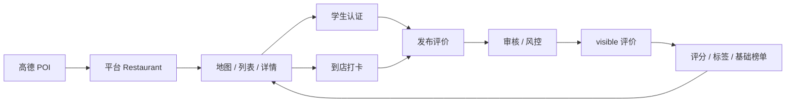

# 岳麓食纪 产品需求文档（PRD）

文档状态：MVP 产品需求文档  
产品阶段：MVP 方案设计 / 原型验证期  
PRD 版本：v1.0  
目标产品版本：v0.2 真实评价 MVP  
最后更新：2026-04-24  
产品负责人：待定  
研发负责人：待定  

## 0. 文档说明

本文档定义岳麓食纪 v0.2 真实评价 MVP 的产品目标、用户场景、功能范围、数据模型、端到端业务闭环、可信评价机制、指标体系、风险控制与版本规划。

v0.2 聚焦一条可验证闭环：真实 POI 商家入库、学生认证、到店打卡、评价发布、内容审核、评价展示与基础榜单刷新。榜单仅提供可复现的基础版本；社区、AI 助手、饭搭子保留入口或概念位置，不作为 v0.2 完整闭环。

## 1. 产品概述

### 1.1 产品名称

岳麓食纪

### 1.2 一句话定位

面向岳麓大学城学生的真实美食地图，用学生认证、真实打卡和本地评价，帮同学快速找到可信、好吃、适合当下场景的餐厅。

### 1.3 产品愿景

成为大学城学生找饭、探店、避雷、约饭的本地生活入口。相比通用点评平台，岳麓食纪更关注“附近学生真实吃过什么、怎么评价、此刻适不适合去”。

### 1.4 核心主张

真实优先：

- 评价来自本地大学生或经可信机制标记的用户。
- 评价尽量绑定真实到店、真实图片、真实消费和真实时间。
- 评分不只看好评，也要呈现避雷、排队、价格、分量、出餐速度等学生高频决策信息。
- 推荐逻辑需要解释“为什么推荐”，避免只给模糊高分。

### 1.5 产品闭环摘要

岳麓食纪的核心闭环为：

```text
真实商家发现 -> 餐厅比较 -> 可信评价决策 -> 到店打卡 -> 发布评价 -> 审核与可信分层 -> 评分/榜单/推荐更新
```

该闭环决定本产品的功能优先级：先保证商家对象真实、地图与列表一致，再建立学生认证和评价可信机制，最后扩展个性化推荐、社区分发和饭搭子社交。

## 2. 背景与机会

### 2.1 背景

岳麓大学城聚集湖南大学、中南大学、湖南师范大学等高校，餐饮密度高、流动性强，学生日常有高频“吃什么”“去哪吃”“有没有坑”“要不要排队”“能不能找人一起吃”的需求。

现有原型和长期设想曾覆盖以下方向，但 v0.2 只选择其中与真实评价闭环直接相关的部分交付：

- 基于高德地图展示岳麓大学城餐厅点位。
- 展示餐厅卡片、详情、热门菜品、学生评价。
- 支持搜索、分类筛选、价格/距离/评分排序。
- 支持收藏、点赞、打卡评价、评价筛选。
- AI 语音助手、随机智选、饭搭子匹配作为后续方向，不进入 v0.2 必做闭环。
- 底部全局入口可承载榜单、语音助手和社区入口，其中语音助手、社区完整能力按后续版本处理。
- 个人中心中已有学生认证、打卡足迹、偏好、勋章等设想。

### 2.2 机会点

通用点评平台的信息足够多，但对学生场景不够“近”和“真”：

- 大量评价无法判断是否来自本地学生。
- 商业推广、刷评、游客评价会影响学生判断。
- 学生更关心“下课后走几分钟、人均多少钱、分量够不够、是否适合一个人/多人、现在排不排队”。
- 大学校区周边很多小店依赖口口相传，信息更新不及时。

岳麓食纪的差异化机会，是把“学生身份 + 到店打卡 + 本地地图 + 场景化推荐”组合成更可信的决策体验。

## 3. 目标与非目标

### 3.1 业务目标

- 建立岳麓大学城餐厅基础库，覆盖学生高频就餐区域。
- 沉淀一批可信学生评价，形成“真实”心智。
- 提升用户从打开地图到决定去哪吃的效率。
- 验证学生认证、到店打卡、评价审核与可信展示的使用意愿。

### 3.2 用户目标

- 快速找到附近靠谱餐厅。
- 知道一家店为什么值得去或为什么要避雷。
- 按预算、距离、口味、排队情况、用餐目的筛选。
- 记录自己的吃饭足迹和收藏。
- 在想结伴时找到合适饭搭子。

### 3.3 非目标

当前阶段暂不追求：

- 完整商家后台和商家营销系统。
- 外卖下单、支付、团购券交易。
- 全长沙范围覆盖。
- 复杂社交关系链。
- 完整商业化广告系统。

## 4. 用户与场景

### 4.1 核心用户

本地在校大学生：

- 学校：湖南大学、中南大学、湖南师范大学等岳麓大学城高校。
- 使用频率：日常高频，午饭、晚饭、夜宵、奶茶、周末探店。
- 核心诉求：便宜、近、好吃、可信、少踩坑。

### 4.2 次级用户

新生 / 外地同学：

- 不熟悉校区周边餐饮分布。
- 更依赖地图、标签、学长学姐推荐和避雷评价。

组队用餐用户：

- 想拼饭、探店、找同校或附近学校同学一起吃。
- 关注口味、人数、社交目的和安全感。

### 4.3 典型场景

- 下课后 15 分钟内决定去哪吃午饭。
- 晚上临时想吃夜宵，需要找近、还开、评价稳的店。
- 想喝奶茶，比较不同店排队情况和学生评价。
- 新生第一次来岳麓大学城，想知道“堕落街哪些店真的值得吃”。
- 宿舍几个人想聚餐，希望找到人均合适、口碑稳定的店。
- 想去一家热门店，但希望找同样想去的人一起排队或拼桌。

## 5. 产品原则

### 5.1 真实优先

任何评分、推荐、榜单都应优先使用可信来源，并显式标记来源可信度。

### 5.2 学生视角

信息展示要围绕学生决策，而不是商家营销。重点字段包括距离、人均、分量、排队、出餐速度、适合场景、是否避雷。

### 5.3 地图即入口

用户打开后应立即看到附近餐厅分布，列表与地图联动，减少查找成本。

### 5.4 轻量参与

评价、收藏、打卡、匹配都应尽量少步骤完成。真实机制不能让用户觉得负担过重。

### 5.5 可信但不压迫

学生认证、到店验证、图片证明等机制要增强信任，但要保护隐私，不公开敏感身份信息。

## 6. v0.2 MVP 范围

### 6.1 版本目标

v0.2 只验证一条主链路：

```text
真实 POI -> 平台商家库 -> 学生认证 / 到店打卡 -> 评价发布 -> 审核 -> 餐厅详情展示 -> 基础榜单刷新
```

本版本不把 AI 助手、饭搭子、完整社区信息流、复杂推荐算法作为必做闭环。若界面保留入口，入口只能展示“未开放”“等待名单”或读取真实审核通过内容，不能使用虚构商家、虚构评价、虚构用户补齐体验。

### 6.2 v0.2 必做

1. 真实商家对象
   - 以高德 POI 作为首个事实来源，导入为平台 `Restaurant`。
   - 明确 `restaurantId` 与外部 `poiId` 的绑定关系。
   - 支持商家生命周期：`imported`、`verified`、`merged`、`conflict`、`closed`。

2. 学生认证
   - 主路径采用校园邮箱认证。
   - 学生证人工审核作为兜底。
   - 认证结果影响评价可信等级、入分权重和高风险能力权限。

3. 到店打卡
   - 支持基于位置的餐厅地理围栏验证。
   - 一次有效打卡最多绑定一条评价。
   - 定位失败时允许发布低可信评价，但不能标记“已到店”。

4. 评价发布、审核与展示
   - 支持评分、文字、可选图片、可选打卡绑定。
   - 评价发布后进入审核或风控判断。
   - 只有满足状态规则的评价进入详情展示、评分聚合和榜单。

5. 基础榜单
   - 支持距离最近、高分优先、学生热评、人均友好等基础榜单。
   - 榜单口径必须可复现，明确候选池、时间窗口、最低评价数、刷新频率。
   - 数据不足时降级为空态或“样本不足”提示，不生成虚构排名。

6. 个人中心最小闭环
   - 展示认证状态、我的评价、我的打卡、我的收藏。
   - 支持查看认证失败原因、重新提交和删除个人内容。

7. 审核后台最小闭环
   - 支持评价、图片、认证材料、申诉的队列处理。
   - 记录审核动作、理由、操作人和时间。

### 6.3 v0.2 非目标

- 饭搭子匹配、聊天、临时群聊和线下安全闭环。
- AI 语音助手、AI 生成评价、复杂自然语言推荐。
- 完整社区信息流、关注关系、勋章体系和社交互动。
- 商家后台、商家认领、广告、团购、支付、外卖。
- 机器学习排序模型和跨城市扩张。

### 6.4 v0.2 可保留入口

| 入口 | v0.2 处理方式 | 限制 |
| --- | --- | --- |
| 榜单 | 可用基础榜单 | 仅使用真实 POI 与审核通过评价 |
| 社区 | 可保留入口 | 默认展示未开放或仅展示 `visible` 评价的只读聚合 |
| AI 助手 | 可保留入口 | 显示待开放，不生成评价或商家事实 |
| 饭搭子 | 可保留入口 | 显示等待名单，不展示虚构匹配结果 |

## 7. 核心功能需求

### 7.1 真实商家库与 POI 关系

#### 用户故事

作为用户，我看到的餐厅必须是真实存在的店；作为平台，评价、打卡和榜单必须绑定到稳定的内部商家对象，而不是直接绑外部 POI。

#### 事实来源

| 来源 | 用途 | v0.2 可信边界 |
| --- | --- | --- |
| 高德 POI | 初始商家名称、坐标、地址、电话、分类、图片 | 可作为商家存在和位置事实，不直接代表学生口碑 |
| 平台评价 | 学生评分、评价正文、图片、热门菜、避雷标签 | 仅审核通过后展示和入分 |
| 平台运营 | 合并、改名、关店、分店确认 | 需保留操作日志 |
| 用户纠错 | 商家信息错误反馈 | v0.2 进入人工队列，不自动改主库 |

#### 主键关系

- `restaurantId`：平台内部商家主键，评价、打卡、收藏、榜单均绑定此字段。
- `poiId`：高德 POI 外部标识，只作为来源绑定字段，不允许替代 `restaurantId`。
- 同一 `Restaurant` 可绑定多个历史 `poiId`，用于改名、合并和数据追溯。
- 当高德 POI 消失或变化时，不删除 `Restaurant`，先进入复核状态。

#### 生命周期

| 状态 | 含义 | 展示规则 | 可入榜 |
| --- | --- | --- | --- |
| `imported` | 由高德 POI 首次导入，未人工确认 | 可在地图和列表展示，标记来源 | 仅可进入距离类榜单 |
| `verified` | 平台确认名称、位置、分类有效 | 正常展示 | 可进入所有满足数据门槛的榜单 |
| `merged` | 已合并到另一商家对象 | 不单独展示，跳转到主 `restaurantId` | 否 |
| `conflict` | 存在重名、重叠、来源冲突 | 可在内部后台展示，前台谨慎展示或隐藏 | 否 |
| `closed` | 已确认关店、搬迁或长期不可用 | 前台隐藏，历史评价保留 | 否 |

#### 合并与冲突规则

- 同一来源且 `poiId` 相同：自动绑定到同一 `restaurantId`。
- 不同 `poiId` 但名称相似度大于等于 0.86、坐标距离小于等于 80 米、分类一致：生成合并候选，必须人工确认。
- 名称相似度大于等于 0.92 且坐标距离小于等于 30 米，但地址或分店名不同：生成高优先级冲突，不自动合并。
- 同品牌多分店：距离大于 80 米或地址明显不同，必须保留为不同 `Restaurant`，名称需补充分店、街区或地标。
- 改名：同 `poiId` 或运营确认同一实体时保留原 `restaurantId`，记录 `aliasNames` 和 `renamedAt`。
- 关店：高德下线、用户反馈、运营巡检任一触发后进入疑似关店复核；确认后标记 `closed`，历史评价不删除但不再入榜。

#### 验收标准

- 任一评价、打卡、收藏记录都能追溯到唯一 `restaurantId`。
- 合并、关店、改名必须保留审计记录。
- 冲突商家不进入基础榜单。

### 7.2 地图、列表与详情

#### 功能要求

- 默认地图中心为岳麓大学城，展示真实餐饮 POI。
- 地图移动或搜索后刷新候选餐厅，并保持地图、列表、详情选中同一个 `Restaurant`。
- 地图加载失败时展示错误状态和重试入口。
- 列表卡片展示名称、距离、地址、分类、来源、评分、人均、可信标签、收藏状态。
- 详情页展示基础信息、学生评价、打卡入口、热门菜、人均、繁忙状态和信息缺失提示。

#### 字段来源与缺失降级

| 字段 | v0.2 数据来源 | 缺失降级 |
| --- | --- | --- |
| 餐厅名称、地址、坐标 | 高德 POI + 平台人工修正 | 不展示无坐标商家 |
| 图片 | 高德 POI 图片或用户审核通过图片 | 展示默认空态，不生成假图 |
| 人均 | 审核通过评价的消费人均；无平台数据时可显示高德参考价 | 标记“暂无学生人均”或“地图参考” |
| 热门菜 | 审核通过评价中的菜品标签聚合，必要时运营手工维护 | 显示“暂无学生推荐菜” |
| 繁忙状态 | 近 2 小时打卡密度、评价标签或人工配置 | 显示“暂无实时拥挤信息” |
| 学生评分 | `visible` 评价聚合 | 显示“暂无学生评分” |

#### 验收标准

- 缺少平台评价时，不用虚构评分、热门菜或繁忙状态补齐。
- 点击地图标记、列表卡片、榜单餐厅后，详情页展示同一个 `restaurantId`。
- `closed` 或 `conflict` 商家不出现在普通列表和榜单中。

### 7.3 学生认证

#### MVP 选型

v0.2 主路径为“校园邮箱认证 + 学生证人工兜底”。

- 校园邮箱认证：用户输入学校和校园邮箱，系统发送验证码或确认链接。
- 学生证人工兜底：当学校邮箱不可用、学校域名未配置或学生无邮箱访问权限时提交学生证图片。
- 不接入学信、校园网探测、第三方强实名作为 v0.2 必做。

#### 状态机

| 状态 | 含义 | 用户可见动作 |
| --- | --- | --- |
| `unverified` | 未提交认证 | 发起邮箱认证或人工认证 |
| `email_pending` | 邮箱验证码待确认 | 输入验证码、重发验证码、取消 |
| `manual_pending` | 学生证材料待审核 | 查看预计完成时间、撤回材料 |
| `verified` | 已认证学生 | 查看认证学校、申请复审 |
| `failed` | 认证失败 | 查看失败原因、重新提交 |
| `revoked` | 认证被撤销 | 发起申诉或重新认证 |
| `expired` | 认证过期 | 重新认证 |

#### 失败原因

- 邮箱域名不在学校白名单。
- 验证码过期或次数超限。
- 该邮箱已绑定其他账号。
- 学生证图片模糊、遮挡或信息不完整。
- 学校信息与材料不一致。
- 疑似伪造、重复提交或非学生身份。

#### SLA 与复审

- 邮箱验证码发送成功率目标：99%。
- 邮箱认证结果反馈：10 分钟内完成。
- 人工审核首响：2 个工作日内。
- 认证申诉复审：3 个工作日内。
- 被拒用户可在 24 小时后重新提交；疑似伪造可限制 7 天。

#### 敏感材料策略

- 学生证原图仅用于人工认证，审核通过或失败后 30 天内删除原图。
- 保留脱敏后的认证结果、学校、认证方式、审核记录和材料哈希。
- 审核员只能查看认证所需字段，不得下载原图。
- 前台只展示学校、认证标识和昵称，不展示学号、姓名、证件照、邮箱完整地址。

### 7.4 到店打卡

#### 功能要求

- 用户登录后可对 `verified` 或 `imported` 餐厅发起打卡。
- 客户端提交经纬度、定位精度、时间、设备风险信号和可选图片。
- 默认地理围栏半径为 120 米；美食城、商场、地下空间可由运营配置为 200 米以内。
- 定位精度小于等于 100 米且用户位置在围栏内，判定为 `location_verified`。
- 定位精度 100-300 米或边界附近，判定为 `location_uncertain`，可发布低可信评价但不标记“已到店”。
- 定位精度大于 300 米、拒绝定位、明显超出围栏，判定为失败。

#### 有效期与绑定

- 一次打卡在创建后 24 小时内可绑定一条评价。
- 一条评价最多绑定一次打卡。
- 同一用户对同一餐厅 6 小时内最多产生一次有效打卡。
- 评价删除后，打卡记录保留为个人足迹，除非用户单独删除足迹。

#### 定位失败降级

- 用户拒绝定位或定位失败时，可以发布未到店验证评价。
- 未到店验证评价默认进入 `pending`，不获得 L2/L3 标签。
- 可通过有图、消费凭证或后续人工复核提升可信度，但不得自动标记到店。

#### 防作弊

- 识别模拟定位、异常速度、同设备多账号、短时间跨区域打卡、重复图片。
- 高风险打卡进入人工复核，不参与可信等级计算。
- 命中严重作弊后，可限制用户 7-30 天发布能力。

### 7.5 评价发布、审核与展示

#### 发布字段

- 必填：`restaurantId`、`rating`、`tasteRating`、`environmentRating`、`serviceRating`、`comment`。
- 可选：`imageIds`、`checkinId`、`avgSpend`、`dishTags`、`sceneTags`、`avoidPitTags`。
- 系统生成：`reviewId`、`userId`、`status`、`verificationLevel`、`riskScore`、`createdAt`。

#### 评价状态规则

| 状态 | 含义 | 详情展示 | 入分 | 进入社区/分发 | 用户可见 |
| --- | --- | --- | --- | --- | --- |
| `draft` | 用户草稿，未提交 | 否 | 否 | 否 | 仅作者可见 |
| `pending` | 已提交，待审核或风控 | 否 | 否 | 否 | 作者可见“审核中” |
| `visible` | 审核通过，正常展示 | 是 | 是 | 可进入后续社区分发 | 所有人可见 |
| `limited` | 低可信或轻微问题，折叠/限流 | 折叠展示 | 否 | 否 | 所有人可展开查看 |
| `rejected` | 审核拒绝 | 否 | 否 | 否 | 作者可见原因 |
| `deleted` | 用户删除或平台删除 | 否 | 否 | 否 | 作者可见删除记录 |
| `appealed` | 申诉处理中 | 保持申诉前状态 | 保持申诉前规则 | 否 | 作者可见进度 |

#### 展示与入分原则

- 餐厅评分、榜单、推荐只使用 `visible` 评价。
- `limited` 评价可在详情“低可信/争议内容”区域折叠展示，不进入评分。
- `pending`、`rejected`、`deleted` 不进入公开列表、榜单和推荐。
- 评价从 `visible` 变更为 `limited`、`rejected` 或 `deleted` 后，聚合分异步重算。
- 用户自己的 `pending` 评价可在个人中心和详情页作者视角展示审核状态。

#### 避雷评价

- 触发条件：总评分小于等于 2 分，或选择卫生、服务态度、价格不符、排队过久、出餐慢、食品安全等避雷标签。
- 涉及食品安全、辱骂、隐私、严重指控的避雷评价进入人工审核。
- 审核通过的避雷评价可展示“已核避雷”标签；未核内容不参与避雷聚合。
- 被评价对象或发布者可发起申诉，申诉期间不自动隐藏已通过内容，除非命中严重违规。

### 7.6 搜索、筛选与场景排序

#### 功能要求

- 支持按餐厅名、地址关键词、分类、标签搜索。
- 支持按距离、人均、学生评分、最新评价、基础榜单排序。
- 支持午饭、晚饭、夜宵、奶茶、赶课、聚餐、一个人吃等场景筛选。

#### 场景排序初版

| 场景 | 排序重点 | 降权因素 |
| --- | --- | --- |
| 赶课 | 距离、出餐速度、近 30 天评价稳定性 | 排队久、出餐慢、位置不明确 |
| 聚餐 | 人均区间、环境评分、多人适合标签 | 桌位少、噪声大、评价样本少 |
| 一个人吃 | 距离、价格、快餐/简餐标签 | 等位久、套餐不友好 |
| 夜宵 | 营业时间、距离、近期评价 | 营业时间未知、关店疑似 |
| 奶茶 | 距离、排队反馈、近期评分 | 排队过久、价格争议 |

#### 验收标准

- 排序规则能被研发复现，不能依赖不可解释的人工口径。
- 数据不足时展示“按距离优先”等降级说明。

### 7.7 基础榜单

#### 候选池

- 候选餐厅必须为 `verified` 或无冲突的 `imported`。
- `closed`、`conflict`、`merged` 子记录不得入榜。
- 榜单默认使用当前地图视野或用户选择区域内的餐厅。

#### 榜单口径

| 榜单 | 主要排序 | 最低门槛 | 时间窗口 | 刷新频率 |
| --- | --- | --- | --- | --- |
| 距离最近 | 用户位置到餐厅距离 | 有有效坐标 | 实时 | 请求时计算 |
| 高分优先 | `visible` 评价加权评分 | 至少 5 条 `visible` 评价且 3 名用户 | 近 180 天优先 | 每小时 |
| 学生热评 | 认证学生 `visible` 评价数和近期待评热度 | 近 90 天至少 3 条认证学生评价 | 近 90 天 | 每小时 |
| 人均友好 | 学生人均与评分综合 | 至少 3 条含人均的 `visible` 评价 | 近 180 天 | 每日 |
| 新店观察 | 新导入或新验证餐厅，距离和收藏/浏览辅助 | 无评分门槛 | 近 30 天 | 每日 |

#### 数据不足降级

- 不满足最低门槛时，不展示“高分”“热评”等强结论。
- 可降级为“附近真实 POI”“等待学生评价”“样本不足榜”。
- 榜单项必须显示数据来源和样本量。

### 7.8 个人中心

#### v0.2 范围

- 展示头像、昵称、学校、认证状态。
- 展示我的收藏、我的打卡、我的评价及审核状态。
- 支持删除评价、删除足迹、撤回认证材料、重新认证。
- 支持基础口味偏好和预算偏好，作为后续推荐输入。

#### 非 v0.2 范围

- 勋章体系、社区等级、好友关系、长期个人主页。

### 7.9 后置入口：社区、AI 与饭搭子

#### 社区

- v0.2 不建设完整社区信息流。
- 如保留入口，只能展示未开放状态，或只读展示审核通过的 `visible` 评价聚合。
- 不提供关注、评论、转发、私信、热帖运营。

#### AI 助手

- v0.2 不提供 AI 生成评价、AI 商家事实补全或语音闭环。
- 如保留入口，应明确标注待开放。
- 任何 AI 文案不得伪装为真实评价、真实热门菜或真实用户反馈。

#### 饭搭子

- v0.2 移出 MVP，仅保留等待名单入口。
- 入口文案应说明功能未开放，不展示虚构候选人、虚构匹配度、虚构聊天。
- 未来开放前置条件：学生认证稳定、举报拉黑可用、聊天风控可用、联系方式保护可用、线下安全提示和未成年人/高风险用户限制策略完成。

## 8. 数据模型

### 8.1 核心枚举

| 枚举 | 取值 |
| --- | --- |
| `RestaurantStatus` | `imported`、`verified`、`merged`、`conflict`、`closed` |
| `VerificationStatus` | `unverified`、`email_pending`、`manual_pending`、`verified`、`failed`、`revoked`、`expired` |
| `CheckinStatus` | `created`、`location_verified`、`location_uncertain`、`failed`、`expired`、`voided` |
| `ReviewStatus` | `draft`、`pending`、`visible`、`limited`、`rejected`、`deleted`、`appealed` |
| `TrustLevel` | `L0_unverified`、`L1_student`、`L2_student_checkin`、`L3_student_checkin_evidence` |
| `ModerationAction` | `approve`、`limit`、`reject`、`delete`、`restore`、`request_more_info`、`restrict_user` |

### 8.2 用户 User

| 字段 | 说明 | 约束 |
| --- | --- | --- |
| `id` | 用户主键 | 全局唯一 |
| `nickname` | 昵称 | 1-20 字，不得包含违规词 |
| `avatarUrl` | 头像 | 可空，需审核或使用默认头像 |
| `school` | 学校 | 来自学校字典 |
| `campus` | 校区 | 可空 |
| `verificationStatus` | 学生认证状态 | 使用 `VerificationStatus` |
| `role` | 权限角色 | `user`、`moderator`、`admin` |
| `restrictionStatus` | 发布限制 | 正常、限评、禁言、封禁 |
| `tastePreference` | 口味偏好 | 可空 |
| `pricePreference` | 预算偏好 | 可空 |
| `createdAt` / `updatedAt` | 时间戳 | 系统维护 |

### 8.3 学生认证 StudentVerification

| 字段 | 说明 | 约束 |
| --- | --- | --- |
| `id` | 认证记录主键 | 全局唯一 |
| `userId` | 用户 ID | 一个用户同一时间最多一个进行中认证 |
| `method` | 认证方式 | `campus_email`、`student_card_manual` |
| `school` | 申报学校 | 必填 |
| `emailDomain` | 邮箱域名 | 邮箱认证必填，仅存域名和脱敏地址 |
| `materialId` | 材料引用 | 人工认证可填，原图短期保存 |
| `status` | 认证状态 | 使用 `VerificationStatus` |
| `failureReason` | 失败原因 | 失败时必填 |
| `reviewerId` | 审核员 | 人工审核时必填 |
| `submittedAt` / `resolvedAt` | 时间戳 | 系统维护 |

### 8.4 餐厅 Restaurant

| 字段 | 说明 | 约束 |
| --- | --- | --- |
| `id` | 平台 `restaurantId` | 全局唯一，所有业务绑定此 ID |
| `name` | 餐厅名称 | 必填 |
| `coordinates` | 经纬度 | 必填，WGS84 或统一坐标系需明确 |
| `address` | 地址 | 必填 |
| `category` | 分类 | 来自平台分类字典 |
| `tags` | 标签 | 仅可来自审核通过评价、运营配置或可信来源 |
| `status` | 生命周期状态 | 使用 `RestaurantStatus` |
| `sourceSummary` | 来源摘要 | 高德、平台、人工修正 |
| `avgRating` | 学生聚合评分 | 仅由 `visible` 评价计算，可空 |
| `avgPrice` | 学生人均 | 仅由审核通过评价或明确来源计算，可空 |
| `busyStatus` | 繁忙状态 | 可空，必须带来源和更新时间 |
| `hotDishes` | 热门菜 | 可空，必须来自评价聚合或运营维护 |
| `createdAt` / `updatedAt` | 时间戳 | 系统维护 |

### 8.5 POI 绑定 RestaurantPoiBinding

| 字段 | 说明 | 约束 |
| --- | --- | --- |
| `id` | 绑定记录主键 | 全局唯一 |
| `restaurantId` | 平台餐厅 ID | 必填 |
| `source` | 来源 | `amap` 等 |
| `poiId` | 外部 POI ID | 同一来源下唯一 |
| `sourceName` / `sourceAddress` | 来源名称和地址 | 保留原始值 |
| `sourceLat` / `sourceLng` | 来源坐标 | 保留原始值 |
| `bindingStatus` | 绑定状态 | active、historical、merged、conflict |
| `createdAt` / `updatedAt` | 时间戳 | 系统维护 |

### 8.6 打卡 Checkin

| 字段 | 说明 | 约束 |
| --- | --- | --- |
| `id` | 打卡主键 | 全局唯一 |
| `userId` | 用户 ID | 必填 |
| `restaurantId` | 餐厅 ID | 必填 |
| `lat` / `lng` | 打卡位置 | 仅用于验证，不公开 |
| `accuracyMeters` | 定位精度 | 必填 |
| `distanceToRestaurant` | 与餐厅距离 | 系统计算 |
| `status` | 打卡状态 | 使用 `CheckinStatus` |
| `riskFlags` | 风险标记 | 可空 |
| `expiresAt` | 可绑定评价截止时间 | 默认 24 小时 |
| `createdAt` | 时间戳 | 系统维护 |

### 8.7 评价 Review

| 字段 | 说明 | 约束 |
| --- | --- | --- |
| `id` | 评价主键 | 全局唯一 |
| `restaurantId` | 餐厅 ID | 必填 |
| `userId` | 用户 ID | 必填 |
| `rating` | 总评分 | 1-5 分 |
| `tasteRating` / `environmentRating` / `serviceRating` | 维度评分 | 1-5 分 |
| `comment` | 评价正文 | 10-500 字 |
| `imageIds` | 图片 | 0-9 张，需审核 |
| `checkinId` | 绑定打卡 | 可空且一对一 |
| `avgSpend` | 本次人均 | 可空，需范围校验 |
| `dishTags` / `sceneTags` / `avoidPitTags` | 标签 | 来自字典或审核生成 |
| `verificationLevel` | 可信等级 | 使用 `TrustLevel` |
| `status` | 评价状态 | 使用 `ReviewStatus` |
| `moderationReason` | 审核原因 | 非正常状态必填 |
| `createdAt` / `updatedAt` | 时间戳 | 系统维护 |

### 8.8 审核与申诉

- `ModerationTask`：记录对象类型、对象 ID、队列、优先级、风险原因、状态、处理人。
- `ModerationLog`：记录每次动作、理由、操作人、时间、前后状态。
- `Appeal`：记录申诉人、对象 ID、申诉理由、材料、处理状态、处理结论。

### 8.9 关键约束

- `Review.restaurantId`、`Checkin.restaurantId`、`Favorite.restaurantId` 只能引用平台 `Restaurant.id`。
- 一个 `Checkin` 最多绑定一个 `Review`。
- `visible` 评价必须有明确审核或自动风控通过记录。
- `closed` 餐厅不能创建新打卡和新评价。
- 删除评价不物理删除审核日志和聚合重算记录。

## 9. 真实性机制

### 9.1 评价可信等级

| 等级 | 条件 | 展示标签 | 入分权重 |
| --- | --- | --- | --- |
| L0 | 未认证或无到店证据 | 普通评价 | 低权重或不入分，视状态决定 |
| L1 | 通过学生认证 | 认证学生 | 标准权重 |
| L2 | 学生认证 + 到店位置验证 | 认证学生、已到店 | 高权重 |
| L3 | 学生认证 + 到店位置验证 + 审核通过图片或消费凭证 | 认证学生、已到店、有图/有凭证 | 最高权重 |

### 9.2 可信标签字典

| 标签 | 触发条件 | 用户含义 |
| --- | --- | --- |
| 认证学生 | `VerificationStatus=verified` | 发布者通过学生认证 |
| 已到店 | 评价绑定 `location_verified` 打卡 | 发布时在餐厅附近 |
| 有图 | 图片审核通过 | 有真实图片辅助判断 |
| 近期 | 评价发布时间在 30 天内 | 更能反映当前情况 |
| 同校 | 浏览用户与发布者学校相同 | 视角可能更接近 |
| 已核避雷 | 避雷内容审核通过 | 负面反馈已经过平台复核 |
| 样本不足 | 评价数未达到榜单或评分门槛 | 不应过度解读分数 |
| 地图参考 | 字段来自高德等外部来源 | 不是平台学生数据 |

### 9.3 异常与降权

- 同一用户短时间内评价多家远距离餐厅，触发风控。
- 同一设备、同一 IP 或相似文本批量评价，触发人工审核。
- 评价文本与商家广告高度相似，默认进入 `pending`。
- 图片重复、疑似网图、与餐厅无关，图片不通过且可能降低评价状态。
- 命中轻微风险的评价可进入 `limited`；命中严重违规进入 `rejected` 或用户限制。

### 9.4 避雷触发与申诉

- 避雷可由低分、避雷标签、关键词和用户举报触发。
- 避雷内容必须区分个人体验和严重事实指控。
- 食品安全、卫生、欺诈、歧视等严重指控优先进入人工审核。
- 发布者可申诉被限制或拒绝的评价；被评价商家或相关用户可申诉侵犯隐私、事实明显错误或恶意攻击。
- 申诉必须保留原内容、处理日志和最终结论，不得静默删除争议记录。

## 10. 内容与审核

### 10.1 审核对象

- 评价正文、评分、标签、图片。
- 学生认证材料。
- 避雷评价、举报内容、申诉材料。
- 用户头像、昵称和个人资料。
- v0.2 不审核饭搭子聊天，因为该功能不开放。

### 10.2 审核队列

| 队列 | 来源 | SLA |
| --- | --- | --- |
| 普通评价 | 新提交评价、低风险图片 | 24 小时内处理 |
| 高风险评价 | 避雷、广告、辱骂、隐私、食品安全 | 4 小时内首响 |
| 学生认证 | 学生证人工材料 | 2 个工作日内处理 |
| 举报 | 用户举报评价或资料 | 24 小时内处理 |
| 申诉 | 评价、认证、限制申诉 | 3 个工作日内处理 |

### 10.3 后台能力

- 队列筛选：对象类型、风险类型、学校、餐厅、状态、提交时间、举报次数。
- 内容查看：原文、图片、关联打卡、用户历史、餐厅信息、风险命中原因。
- 审核动作：通过、限流、折叠、拒绝、删除、恢复、要求补充材料、限制用户。
- 批注理由：必须选择标准原因，可补充说明。
- 操作日志：记录操作人、动作、前状态、后状态、时间、原因。
- 申诉处理：查看原判、申诉材料、历史日志，支持维持、恢复、改为限流或删除。
- 权限隔离：认证审核员只能处理认证材料；内容审核员处理 UGC；管理员处理用户限制和配置。

### 10.4 处理规则

- 无关内容、广告、刷屏：拒绝或限流。
- 辱骂、歧视、隐私泄露：删除并通知用户，严重时限制发布。
- 食品安全等严重避雷：先人工复核，再决定展示、折叠或补充说明。
- 商家诱导好评、自评、营销内容：拒绝并记录风控标签。
- 审核结论应通过站内消息或个人中心状态告知用户。

## 11. 指标体系与埋点

### 11.1 北极星指标

每周由认证学生贡献并审核通过的有效真实评价数。

有效真实评价定义：

- `Review.status=visible`。
- 评价正文不少于 10 字。
- 绑定真实 `restaurantId`。
- 发布者为认证学生或评价绑定有效到店打卡。

### 11.2 核心指标

- 新增认证学生数、认证通过率、认证平均处理时长。
- 到店打卡成功率、定位失败率、疑似作弊率。
- 评价提交数、审核通过率、审核平均处理时长。
- 每家餐厅 `visible` 评价数、认证学生评价占比、L2/L3 占比。
- 餐厅详情页访问率、从详情到打卡/评价转化率。
- 榜单打开率、榜单餐厅点击率、样本不足榜单占比。
- 举报率、申诉率、申诉改判率。

### 11.3 体验指标

- 首页首屏可交互时间。
- 地图加载失败率。
- 搜索无结果率。
- 详情页字段缺失率。
- 评价发布失败率。
- 审核通知触达率。

### 11.4 埋点事件表

| 事件名 | 触发时机 | 关键属性 | 指标用途 |
| --- | --- | --- | --- |
| `app_open` | 用户打开首页 | `userId`、`loginStatus`、`locationPermission` | 入口规模、定位授权 |
| `map_poi_loaded` | POI 列表加载完成 | `source`、`count`、`radius`、`errorCode` | 商家覆盖、地图稳定性 |
| `restaurant_card_click` | 点击餐厅卡片 | `restaurantId`、`sourceStatus`、`rankPosition` | 列表点击转化 |
| `restaurant_detail_view` | 进入餐厅详情 | `restaurantId`、`hasStudentRating`、`reviewCount` | 详情访问和数据完整度 |
| `verification_start` | 发起学生认证 | `method`、`school` | 认证漏斗 |
| `verification_result` | 认证出结果 | `method`、`status`、`failureReason`、`duration` | 通过率、SLA |
| `checkin_attempt` | 发起打卡 | `restaurantId`、`accuracyMeters`、`distance` | 打卡使用与定位质量 |
| `checkin_result` | 打卡完成 | `restaurantId`、`status`、`riskFlags` | 打卡成功率、防作弊 |
| `review_submit` | 提交评价 | `restaurantId`、`hasCheckin`、`hasImage`、`rating` | 评价转化与质量 |
| `review_status_change` | 评价状态变化 | `reviewId`、`fromStatus`、`toStatus`、`reason` | 审核效率、内容质量 |
| `ranking_open` | 打开榜单 | `rankingType`、`areaId`、`candidateCount` | 榜单使用 |
| `ranking_item_click` | 点击榜单餐厅 | `rankingType`、`restaurantId`、`position`、`sampleSize` | 榜单有效性 |
| `report_submit` | 提交举报 | `objectType`、`objectId`、`reason` | 风险发现 |
| `appeal_submit` | 提交申诉 | `objectType`、`objectId`、`reason` | 申诉负载 |
| `waitlist_join` | 加入后置功能等待名单 | `feature`、`userStatus` | 后续版本需求判断 |

## 12. 非功能、隐私与权限

### 12.1 性能与可用性

- 首页首屏应尽量在 3 秒内可交互；地图失败时不白屏。
- 餐厅列表滚动应保持流畅，图片懒加载和压缩。
- 关键操作具备加载、成功、失败、重试和空状态。
- 后台审核列表支持分页、筛选和批量操作，避免一次性加载大量图片。

### 12.2 隐私数据清单

| 数据 | 用途 | 是否必填 | 保存周期 | 脱敏方式 | 访问角色 | 删除/撤回路径 |
| --- | --- | --- | --- | --- | --- | --- |
| 手机号/登录标识 | 登录、账号安全 | 视登录方式 | 账号存续期 | 前台隐藏中间位 | 用户本人、系统管理员 | 注销账号 |
| 昵称、头像 | 前台展示 | 昵称必填 | 账号存续期 | 违规审核，默认头像兜底 | 所有人可见 | 个人中心修改/删除 |
| 学校、校区 | 认证展示、同校标签 | 认证时必填 | 账号存续期 | 只展示学校，不展示院系班级 | 用户本人、认证审核员 | 撤销认证或注销 |
| 校园邮箱 | 邮箱认证 | 邮箱认证必填 | 认证期间及必要审计期 | 仅存哈希、域名和脱敏地址 | 用户本人、认证系统 | 撤销认证后删除明文 |
| 学生证图片 | 人工认证 | 人工兜底必填 | 审核完成后 30 天内删除原图 | 加密存储、禁止下载 | 认证审核员 | 用户撤回或到期自动删除 |
| 打卡经纬度 | 到店验证、防作弊 | 打卡必填 | 180 天或用户删除足迹 | 前台不展示精确位置 | 用户本人、风控、审核员 | 删除足迹/注销账号 |
| 评价正文和图片 | 餐厅评价展示 | 评价正文必填，图片可选 | 内容存续期 | 隐私信息审核和打码 | 所有人可见，审核员可处理 | 删除评价/申诉 |
| 人均消费 | 聚合人均 | 可选 | 内容存续期 | 仅聚合展示 | 审核员、系统 | 删除评价 |
| 设备和风险信号 | 防作弊、安全 | 系统采集 | 180 天 | 不对前台展示 | 风控、管理员 | 注销后按安全策略清理 |
| 收藏、偏好 | 个性化与个人中心 | 可选 | 账号存续期 | 仅本人可见 | 用户本人、系统 | 取消收藏/清空偏好 |

### 12.3 权限矩阵

| 能力 | 未登录 | 未认证用户 | 认证学生 | 受限用户 | 审核员 |
| --- | --- | --- | --- | --- | --- |
| 浏览地图、列表、详情 | 可 | 可 | 可 | 可 | 可 |
| 搜索、筛选、榜单浏览 | 可 | 可 | 可 | 可 | 可 |
| 收藏餐厅 | 不可 | 可 | 可 | 视限制 | 可 |
| 发起打卡 | 不可 | 可 | 可 | 视限制 | 可 |
| 发布评价 | 不可 | 可，默认低可信 | 可，按认证入分 | 受限或不可 | 可作为普通用户发布 |
| 评价入高可信权重 | 不可 | 需到店或审核 | 可按 L1-L3 | 不可或降权 | 不因角色加权 |
| 举报内容 | 不可 | 可 | 可 | 可 | 可 |
| 申诉本人内容 | 不可 | 可 | 可 | 可 | 可 |
| 处理审核队列 | 不可 | 不可 | 不可 | 不可 | 可 |
| 查看认证原始材料 | 不可 | 仅本人提交态 | 仅本人提交态 | 仅本人提交态 | 认证审核员可见 |

### 12.4 安全要求

- 后台接口必须鉴权，并按角色控制字段级访问。
- 打卡、评价、认证接口需要频率限制和重复提交保护。
- 审核后台操作必须有日志，不允许无记录修改内容状态。
- 敏感材料需要加密存储，生产环境禁止直接暴露对象存储地址。

## 13. 版本规划

### 13.1 v0.1 前端基座与真实 POI

目标：完成地图找店主链路和统一餐厅模型，为真实评价闭环提供稳定商家对象。

- 接入高德 POI，建立真实商家发现能力。
- 统一 `Restaurant` 模型，保证地图、列表、详情使用同一餐厅对象。
- 完成搜索、筛选、排序、收藏、详情联动等基础体验。
- 将未接真实数据的模块与主链路隔离。

### 13.2 v0.2 真实评价 MVP

目标：验证“真实 POI + 学生认证 + 到店打卡 + 审核评价”的可信闭环。

前置条件：

- 用户系统和登录态可用。
- 平台 `Restaurant`、`Review`、`Checkin`、`StudentVerification` 基础表可用。
- 审核后台最小队列可用。
- 高德 POI 导入和 `restaurantId` 绑定关系可追溯。

交付范围：

- 商家库生命周期、合并和冲突处理。
- 校园邮箱认证与学生证人工兜底。
- 到店打卡、评价发布、评价审核、评价展示。
- 基础榜单和样本不足降级。
- 个人中心中的认证、评价、打卡、收藏。

### 13.3 v0.3 推荐、社区与运营增强

目标：在真实评价数据达到最低密度后，提高发现效率和内容分发能力。

- 场景推荐和推荐理由。
- 只读社区信息流或评价分发。
- 商家纠错、运营标签、热门菜运营后台。
- 更完整的数据看板和冷启动运营工具。

前置条件：

- v0.2 Go 指标达标。
- 核心区域每家高频餐厅有足够 `visible` 评价样本。
- 审核 SLA 稳定。

### 13.4 v0.4 饭搭子与社交安全

目标：在学生认证、举报、风控和内容审核稳定后，验证陌生人约饭需求。

- 匹配请求和候选结果。
- 打招呼、临时会话、举报拉黑。
- 精确联系方式保护、线下安全提示、受限用户拦截。

前置条件：

- 学生认证通过率和投诉处理能力达标。
- 用户限制、举报、拉黑、聊天审核机制可用。
- 完成饭搭子安全评审和应急处理预案。

## 14. 风险与应对

### 14.1 真实评价冷启动难

风险：没有足够真实评价时，产品差异化不明显。

应对：

- 先覆盖少量高频区域和高频店。
- 通过校园种子用户贡献首批评价。
- 设置打卡、勋章、榜单等轻激励。

### 14.2 刷评和商家干预

风险：真实性心智一旦被破坏，产品价值会下降。

应对：

- 学生认证和到店验证提高权重。
- 异常评价检测和人工审核。
- 商家内容与学生评价严格区分。

### 14.3 认证门槛影响增长

风险：认证流程过重导致用户不愿参与。

应对：

- 浏览不强制认证。
- 发布普通评价不一定强制认证，但低权重展示。
- 高影响力能力，如高权重评价、饭搭子匹配、榜单影响，需要认证。

### 14.4 社交安全风险

风险：饭搭子功能涉及陌生人社交。

应对：

- 默认只展示学校、昵称和标签。
- 必须提供举报、拉黑、限制联系方式暴露。
- 对未认证用户限制匹配和聊天能力。

## 15. 实施范围、依赖与发布门槛

### 15.1 v0.2 交付范围

v0.2 必须完成以下端到端能力：

- 商家库：真实 POI 导入、`restaurantId` 生成、POI 绑定、生命周期状态、合并/冲突/关店处理。
- 地图找店：地图、列表、详情围绕同一 `Restaurant` 对象联动。
- 学生认证：校园邮箱认证、学生证人工兜底、失败原因、复审和材料删除策略。
- 到店打卡：地理围栏、定位误差处理、有效期、评价绑定、防作弊。
- 评价系统：评价提交、状态机、图片上传、可信等级、展示与入分规则。
- 审核后台：评价、认证、举报、申诉队列，审核动作和日志。
- 基础榜单：可复现榜单规则、样本门槛、刷新频率和数据不足降级。
- 个人中心：认证状态、我的评价、我的打卡、我的收藏、删除和申诉入口。
- 隐私与权限：隐私数据清单、角色权限矩阵、敏感字段访问控制。
- 埋点：覆盖认证、打卡、评价、审核、榜单和核心浏览转化。

### 15.2 上线依赖

- 地图服务：高德地图 JS API、POI 搜索、地理编码、浏览器定位。
- 用户系统：登录、用户资料、学校字典、角色与权限。
- 数据服务：商家库、POI 绑定、评价库、打卡库、认证库、收藏库、榜单快照。
- 图片服务：上传、压缩、存储、访问控制、图片审核。
- 审核后台：队列、筛选、审核动作、日志、申诉、用户限制。
- 通知系统：认证结果、审核结果、申诉结果通知。
- 埋点系统：事件采集、关键属性校验、基础数据看板。

### 15.3 Go 发布门槛

满足以下条件时，v0.2 可以进入小范围灰度：

- 主链路没有虚构商家、虚构评价、虚构热门菜或虚构定位。
- 新增评价、打卡、收藏全部绑定平台 `restaurantId`，不存在直接绑定高德 `poiId` 的业务记录。
- `closed`、`conflict`、`merged` 子记录不会进入普通列表、详情和榜单。
- 校园邮箱认证和学生证人工兜底均可完成闭环，认证失败能展示原因。
- 打卡地理围栏、定位误差、有效期和一打卡一评价限制生效。
- 评价状态机生效，只有 `visible` 评价进入评分、榜单和推荐权重。
- 审核后台能处理评价、认证、举报、申诉，并保留操作日志。
- 基础榜单能展示样本量、时间窗口和数据不足降级。
- 隐私清单中的敏感字段不在前台暴露，认证材料有删除机制。
- 核心埋点事件可以被采集并关联关键业务对象。

### 15.4 No-Go 条件

出现以下任一情况，不应发布 v0.2：

- 使用 mock 内容伪装真实商家、真实评价、真实热门菜或真实饭搭子。
- 未审核评价进入公开评分、榜单或推荐。
- 学生证原图、学号、完整邮箱、精确打卡位置被非授权角色查看。
- 商家合并冲突无法追溯，导致评价或打卡绑定错误商家。
- 认证失败、评价拒绝、用户限制没有原因和申诉路径。
- 审核后台无法处理高风险避雷或隐私举报。

### 15.5 暂不纳入 v0.2

- 外卖下单、支付、团购券交易。
- 完整商家后台、商家认领、广告投放。
- 跨城市扩张。
- 完整社区互动、好友关系、长期群聊。
- AI 语音助手、AI 生成评价、机器学习排序模型。
- 全自动证件 OCR 认证。

## 16. 待确认问题

- 首期灰度区域：先覆盖湖南大学周边、天马学生公寓、麓山南路，还是同时覆盖中南大学和湖南师范大学周边。
- 学校邮箱域名白名单：各学校本科生、研究生、校友邮箱域名及异常域名处理。
- 学生证人工审核尺度：哪些字段必须可见，哪些字段应由用户主动遮挡。
- 美食城、商场、地下空间的地理围栏半径是否需要逐店配置。
- 消费凭证是否进入 v0.2 L3 条件，还是先仅支持审核通过图片。
- 审核人力配置：灰度期每日评价、认证、举报的预计处理量和排班。
- 榜单最低样本门槛是否允许按灰度区域临时调整；如调整，前台必须同步展示“样本不足”。

## 17. 信息架构

- 首页地图
  - 地图点位
  - 附近餐厅列表
  - 搜索
  - 筛选
  - 场景排序
  - 定位
  - 底部全局按钮 BAR
    - 基础榜单
    - AI 助手入口：待开放
    - 社区入口：待开放或只读真实评价聚合
- 餐厅详情
  - 基础信息
  - 字段来源与缺失提示
  - 热门菜品
  - 学生评价
  - 避雷评价
  - 到店打卡
  - 发布评价
- 评价与认证
  - 学生认证
  - 打卡验证
  - 发布评价
  - 图片上传
  - 审核状态
  - 申诉入口
- 个人中心
  - 学生认证状态
  - 我的收藏
  - 我的足迹
  - 我的评价
  - 审核/申诉状态
  - 用餐偏好
- 审核后台
  - 评价队列
  - 认证队列
  - 举报队列
  - 申诉队列
  - 操作日志
- 后置能力入口
  - 饭搭子等待名单
  - AI 助手待开放页
  - 社区待开放页

## 18. 端到端业务闭环设计

### 18.1 v0.2 主闭环

岳麓食纪 v0.2 的主闭环不是“展示更多功能”，而是让真实商家和真实评价形成可验证的正循环。



### 18.2 数据闭环

商家闭环：

- 输入：高德 POI、平台运营确认、用户纠错。
- 处理：生成或更新 `Restaurant`，维护 POI 绑定和生命周期。
- 输出：地图点位、列表、详情、榜单候选池。
- 约束：冲突和关店商家不进入前台主链路。

认证闭环：

- 输入：校园邮箱、学生证人工材料。
- 处理：校验域名、验证码、人工审核、失败原因、复审。
- 输出：`VerificationStatus`、学校标识、可信标签。
- 约束：敏感材料不公开，原图按策略删除。

打卡闭环：

- 输入：用户位置、定位精度、餐厅围栏、设备风险信号。
- 处理：地理围栏判定、误差降级、防作弊。
- 输出：`CheckinStatus`、到店标签、评价可信等级输入。
- 约束：打卡位置不公开，一次打卡最多绑定一条评价。

评价闭环：

- 输入：评分、正文、图片、打卡、认证状态。
- 处理：风控、审核、可信等级、状态机。
- 输出：详情评价、学生评分、避雷标签、榜单聚合。
- 约束：只有 `visible` 评价入分和入榜。

### 18.3 产品取舍

- 先闭环后扩展：v0.2 只保证真实评价主链路可用，再扩展社区、AI、饭搭子。
- 先可解释后复杂排序：榜单采用规则口径，所有门槛、窗口和样本量可见。
- 先低风险后高风险：陌生人社交和 AI 生成内容在审核、风控、隐私能力稳定前不开放。
- 先小区域后扩张：优先覆盖高频学生就餐区域，避免评价密度过低导致榜单失真。

## 19. 服务与接口设计

### 19.1 服务边界

v0.2 后端按以下领域拆分：

- `RestaurantService`：商家库、POI 绑定、生命周期、合并、冲突、关店。
- `IdentityService`：登录、学校字典、校园邮箱认证、学生证人工认证。
- `CheckinService`：到店打卡、地理围栏、定位误差、防作弊。
- `ReviewService`：评价发布、读取、状态机、评分聚合、标签聚合。
- `ModerationService`：审核队列、举报、申诉、用户限制、操作日志。
- `RankingService`：基础榜单、榜单快照、数据不足降级。
- `AnalyticsService`：埋点事件接收和指标计算。

`MatchService`、AI 助手服务、完整社区服务不属于 v0.2 必做范围。

### 19.2 核心接口

餐厅发现：

```http
GET /api/restaurants?lat={lat}&lng={lng}&radius={meters}&keyword={keyword}&category={category}&sort={sort}
```

返回重点：

- `restaurants[]`：统一 `Restaurant` 模型。
- `restaurantId`：平台内部主键。
- `sourceSummary`：高德、平台人工、评价聚合等来源摘要。
- `dataCompleteness`：评分、人均、热门菜、繁忙状态是否缺失。

餐厅详情：

```http
GET /api/restaurants/{restaurantId}
```

返回重点：

- 基础信息、POI 来源、生命周期状态。
- 学生评分、样本量、可信评价占比。
- 热门菜、人均、繁忙状态及来源。
- 当前用户收藏、最近打卡、可评价状态。

学生认证：

```http
POST /api/student-verifications/email/start
POST /api/student-verifications/email/confirm
POST /api/student-verifications/manual
GET /api/student-verifications/current
```

请求与返回重点：

- `school`、`campusEmail`、`code` 或 `materialId`。
- `status`、`failureReason`、`estimatedReviewTime`。
- 返回脱敏邮箱和学校，不返回学生证原图地址。

打卡：

```http
POST /api/checkins
GET /api/checkins/{checkinId}
```

请求重点：

- `restaurantId`、`lat`、`lng`、`accuracyMeters`、`clientTraceId`。
- 可选 `imageIds`。

返回重点：

- `checkinId`、`status`、`distanceToRestaurant`、`expiresAt`、`riskFlags`。

评价发布与读取：

```http
POST /api/restaurants/{restaurantId}/reviews
GET /api/restaurants/{restaurantId}/reviews?filter={filter}&cursor={cursor}
GET /api/users/me/reviews
DELETE /api/reviews/{reviewId}
POST /api/reviews/{reviewId}/appeals
```

请求重点：

- `rating`、`tasteRating`、`environmentRating`、`serviceRating`。
- `comment`、`imageIds`、`checkinId`、`avgSpend`、`dishTags`、`avoidPitTags`。
- `clientTraceId` 防止重复提交。

返回重点：

- `reviewId`、`status`、`verificationLevel`、`moderationReason`、`visibleAfter`。

基础榜单：

```http
GET /api/rankings?type={type}&lat={lat}&lng={lng}&radius={meters}&scene={scene}
```

返回重点：

- `rankingType`、`generatedAt`、`timeWindow`、`minSampleSize`。
- `items[]` 中包含 `restaurantId`、`position`、`scoreBreakdown`、`sampleSize`、`fallbackReason`。

审核后台：

```http
GET /api/admin/moderation/tasks?queue={queue}&status={status}&risk={risk}
POST /api/admin/moderation/tasks/{taskId}/actions
GET /api/admin/moderation/logs?objectType={objectType}&objectId={objectId}
```

动作重点：

- `action`、`reasonCode`、`note`、`nextStatus`。
- 所有动作必须写入 `ModerationLog`。

### 19.3 数据一致性原则

- 前台和后端业务接口只接受平台 `restaurantId`，不接受直接以 `poiId` 发布评价、打卡或收藏。
- POI 导入、合并、关店和冲突处理必须保留历史绑定记录。
- 评价发布成功后先展示作者视角的状态，再等待审核结果刷新公开列表。
- 评分聚合和榜单刷新异步执行，但必须能追溯到使用的评价集合和时间窗口。
- 审核状态变更后，相关餐厅评分、标签和榜单应触发重算或标记待重算。

## 20. 可信评分、榜单与降级规则

### 20.1 评价可信分

单条评价可信分用于内部排序和审核辅助，不直接向用户展示。

| 维度 | 说明 | v0.2 权重 |
| --- | --- | --- |
| 学生认证 | 发布者是否为认证学生 | 30% |
| 到店验证 | 是否绑定有效到店打卡 | 25% |
| 内容质量 | 字数、图片、具体菜品、消费信息、避雷细节 | 20% |
| 时间新鲜度 | 近 30 天、90 天、180 天递减 | 15% |
| 用户历史 | 历史通过率、举报率、重复率 | 10% |

可信分转化为可理解标签：认证学生、已到店、有图、近期、同校、已核避雷、样本不足。

### 20.2 餐厅学生评分

v0.2 餐厅学生评分只由 `visible` 评价计算。

```text
学生评分 = sum(评价总分 * 可信权重 * 时间权重) / sum(可信权重 * 时间权重)
```

规则：

- `visible` 评价少于 3 条时，不展示学生评分，只展示“暂无足够学生评分”。
- `visible` 评价达到 3 条但少于 5 条时，可展示评分但必须标记“样本不足”。
- `limited`、`pending`、`rejected`、`deleted` 不参与计算。
- 高德评分如展示，只能标记为“地图参考”，不得混入学生评分。

### 20.3 基础榜单评分

距离最近：

```text
按用户位置到餐厅坐标距离升序
```

高分优先：

```text
榜单分 = 学生评分 * 0.7 + 可信评价占比 * 0.2 + 新鲜度 * 0.1 - 避雷惩罚
```

学生热评：

```text
热评分 = 近 90 天认证学生 visible 评价数 * 0.5 + 近 90 天收藏/详情访问热度 * 0.2 + 新鲜度 * 0.2 - 避雷惩罚 * 0.1
```

人均友好：

```text
友好分 = 预算匹配分 * 0.4 + 学生评分 * 0.4 + 可信评价占比 * 0.2
```

新店观察：

```text
观察分 = 距离分 * 0.4 + 完整度分 * 0.3 + 近期浏览/收藏 * 0.3
```

所有榜单项需展示样本量、时间窗口和主要理由。

### 20.4 场景推荐规则

v0.2 的场景排序是规则筛选，不宣传为智能算法。

- 赶课：距离、出餐速度、快餐标签优先，排队久和位置不明确降权。
- 聚餐：环境评分、多人适合、人均稳定优先，样本不足降权。
- 夜宵：营业时间可信、距离近、近期评价优先，营业时间未知降权。
- 奶茶：距离、近期排队反馈、价格争议少优先。
- 一个人吃：人均、简餐标签、无需等位优先。

当任一场景缺少足够数据时，排序降级为距离和基础分类，不输出过度解释。

### 20.5 冷启动与缺失降级

商家冷启动：

- 可展示高德 POI 提供的位置、分类、电话、图片。
- 缺少平台学生评价时，显示“暂无学生评价”。
- `imported` 商家只进入距离类或新店观察类榜单。

评价冷启动：

- 优先招募种子用户对高频区域真实消费后评价。
- 不使用运营撰写内容冒充学生评价。
- 首评、有图、已到店、已核避雷可作为轻激励标签，但不改变事实状态。

榜单冷启动：

- 未达到最低评价门槛时，榜单显示“样本不足”。
- 允许展示“附近真实 POI”作为降级列表，但必须与学生热评、高分榜区分。
- 不把高德评分和平台学生评分混算。

字段缺失：

- 热门菜缺失：展示“暂无学生推荐菜”。
- 人均缺失：展示“暂无学生人均”，高德参考价需标注来源。
- 繁忙状态缺失：展示“暂无实时拥挤信息”。
- 营业时间缺失：不参与夜宵场景强推荐。
